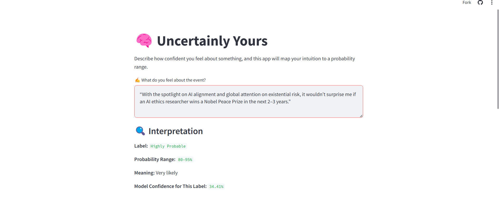
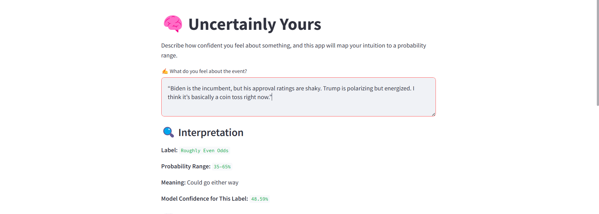
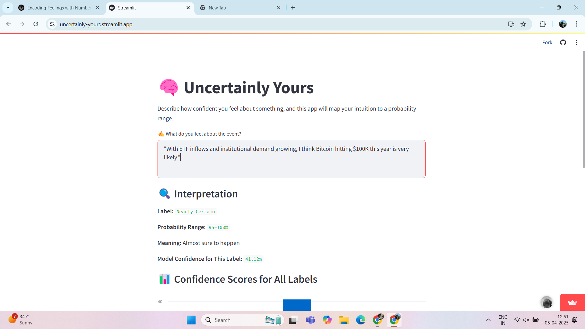
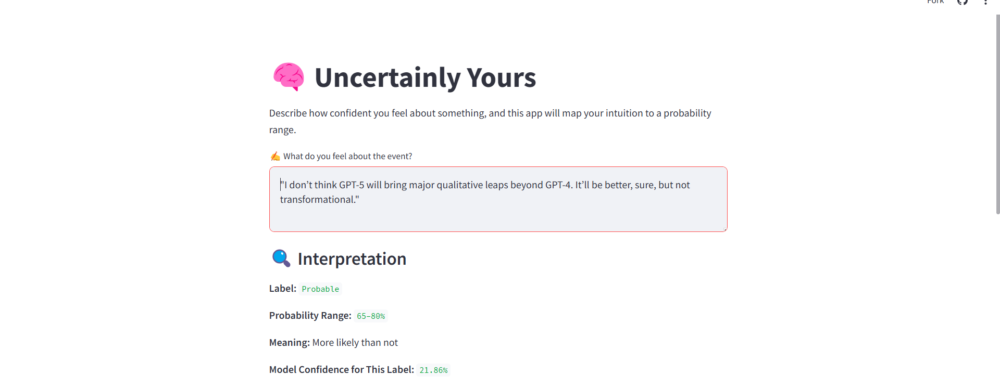
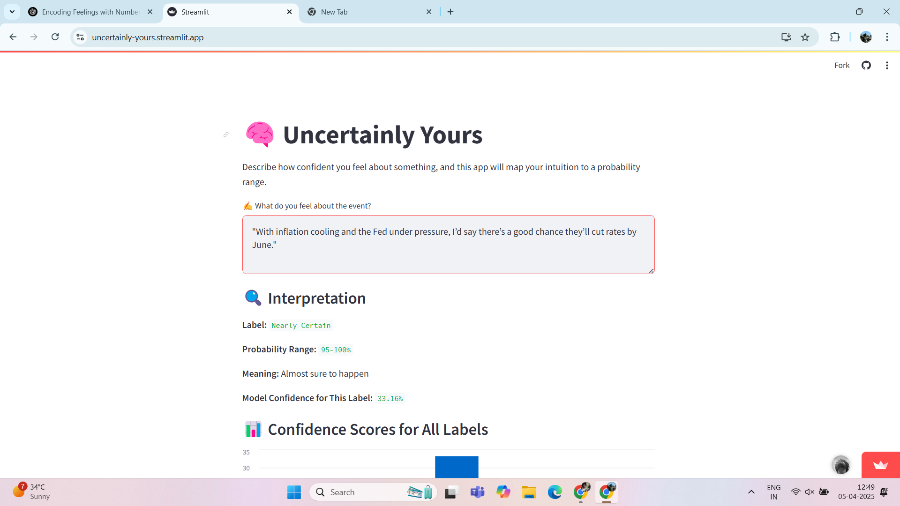
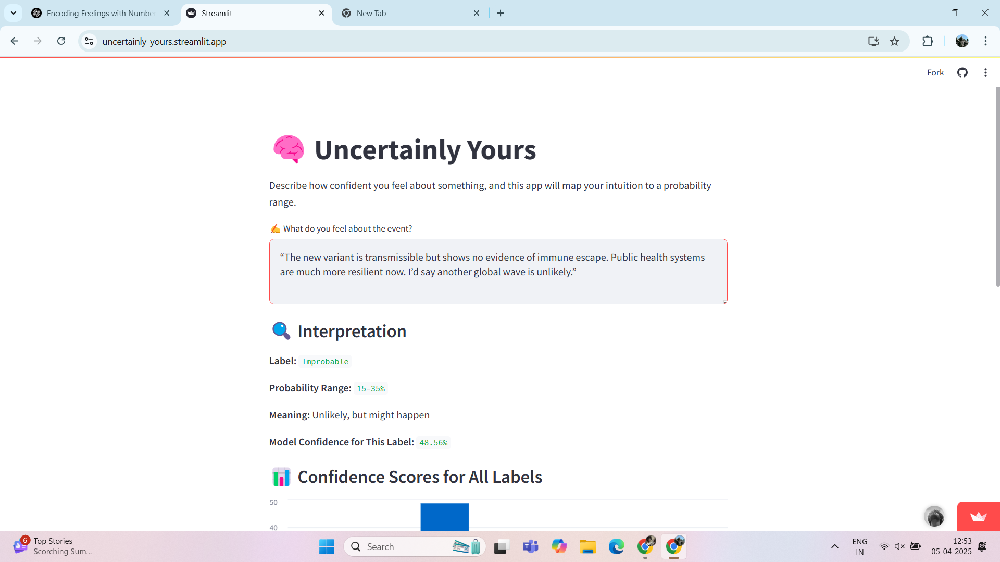
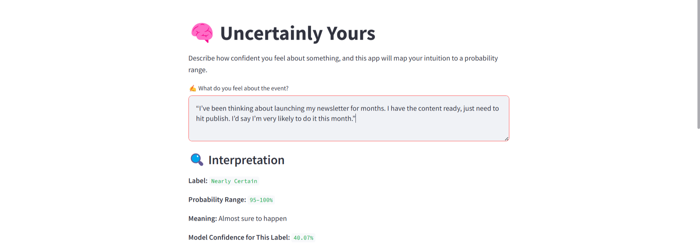

# Uncertainly Yours

**Uncertainly Yours** is a tool for transforming your gut feelings into probability estimates. This app uses zero-shot natural language classification to map your intuition to a probability label, range, and interpretation.

---

## 🔍 What It Does

- Accepts natural language input like “It’s probably going to happen soon.”
- Uses HuggingFace’s `facebook/bart-large-mnli` to classify the tone of certainty.
- Maps your statement to a **calibrated probability label**:
  - *Remote*, *Highly Improbable*, *Improbable*, etc.
- Displays:
  - A probability **range**
  - A brief **interpretation**
  - A **bar chart** of confidence scores across all labels

## 📸 Results

Here are a few example forecasts generated using the app:

### 🟣 Prompt 1: Nobel Peace Prize to AI Researcher
“With the spotlight on AI alignment and global attention on existential risk, it wouldn’t surprise me if an AI ethics researcher wins a Nobel Peace Prize in the next 2–3 years.”

### 🔵 Prompt 2: 2024 US Presidential Election Outcome
“Biden is the incumbent, but his approval ratings are shaky. Trump is polarizing but energized. I think it’s basically a coin toss right now.”

### 🟡 Prompt 3: Bitcoin Hits $100K
“With ETF inflows and institutional demand growing, I think Bitcoin hitting $100K this year is very likely.”

### 🟣 Prompt 4: GPT-5 Will Be Transformational
“I don’t think GPT-5 will bring major qualitative leaps beyond GPT-4. It’ll be better, sure, but not transformational.”

### 🟢 Prompt 5: India Meets 2030 Climate Goals
“India is making big announcements, but implementation is slow. I’m doubtful they’ll meet 2030 interim goals unless there’s a huge shift.”

### 🟢 Prompt 2: US Federal Rate Cut by June
“With inflation cooling and the Fed under pressure, I’d say there’s a good chance they’ll cut rates by June.”

### 🔴 Prompt 9: New COVID Variant Causes Global Wave
“The new variant is transmissible but shows no evidence of immune escape. Public health systems are much more resilient now. I’d say another global wave is unlikely.”

### 👤 Prompt 10: Personal Project Launch
“I’ve been thinking about launching my newsletter for months. I have the content ready, just need to hit publish. I’d say I’m very likely to do it this month.”

 

---
